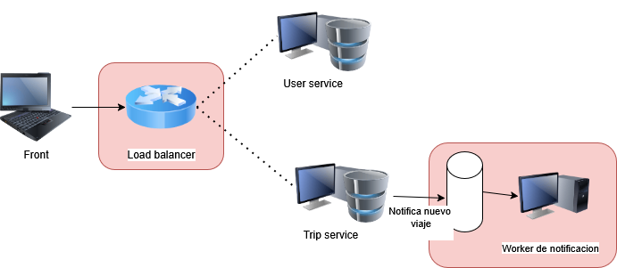
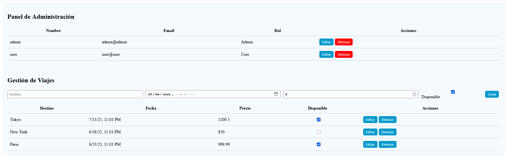
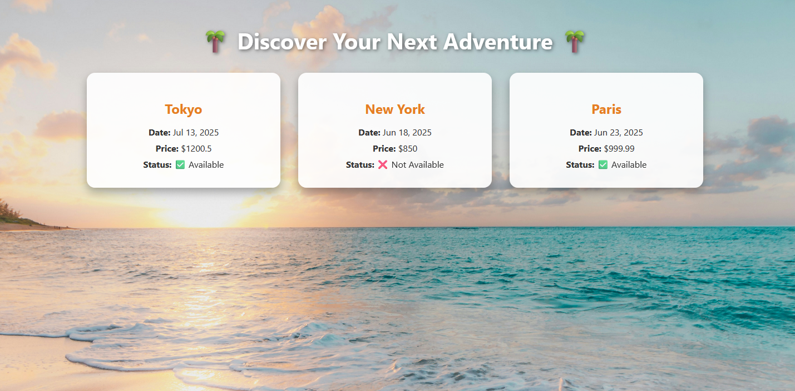

# mini_viajes

Incluye un backend en .NET 9 y un frontend en Angular 16.

---

## 🛠️ Requisitos Previos

### Backend
- [.NET 9 SDK](https://dotnet.microsoft.com/en-us/download/dotnet/9.0)
- [Entity Framework CLI](https://learn.microsoft.com/en-us/ef/core/cli/dotnet)

### Frontend
- [nvm (Node Version Manager)](https://github.com/nvm-sh/nvm)
- Node.js 18 LTS
- Angular CLI 16

---

## 🚀 Cómo ejecutar el backend

1. Aplica las migraciones a la base de datos:
```bash
dotnet ef database update
````

2. Corre la aplicación:

```bash
dotnet run
```

3. Accede a las APIs:

* Autenticación: [http://localhost:5062/swagger/index.html](http://localhost:5062/swagger/index.html)
* Trips API: [http://localhost:5254/swagger/index.html](http://localhost:5254/swagger/index.html)

---

## 👤 Usuarios creados por defecto

| Rol   | Usuario | Contraseña |
| ----- | ------- | ---------- |
| Admin | admin   | 123        |
| User  | user    | 123        |

---

## 🌐 Cómo ejecutar el frontend

1. Instala `nvm`:

```bash
curl -o- https://raw.githubusercontent.com/nvm-sh/nvm/v0.40.3/install.sh | bash
```

2. Reinicia la terminal o ejecuta:

```bash
source ~/.bashrc  # o ~/.zshrc
```

3. Instala y usa Node.js 18 LTS:

```bash
nvm install 18
nvm use 18
```

4. Verifica versiones:

```bash
node -v
npm -v
```

5. Instala Angular CLI 16:

```bash
npm install -g @angular/cli@16
```

6. En la carpeta del frontend, corre la aplicación:

```bash
ng serve
```

---

¡Listo! El frontend debería estar disponible en [http://localhost:4200](http://localhost:4200).

## 🔐 Autenticación y Autorización

### API disponibles

El sistema tiene **dos APIs principales**:

1. **API de Usuarios**
2. **API de Viajes**

---

### 🧑💼 Roles y Permisos

Hay **dos tipos de roles** definidos:

| Rol   | Permisos                                                                 |
|--------|-------------------------------------------------------------------------|
| Admin  | Acceso completo a todos los endpoints: crear, editar, eliminar y ver.  |
| User   | Solo puede **consultar viajes**. No tiene acceso a crear/editar.       |

---

### 🔑 Autenticación con JWT

Para consumir cualquier endpoint protegido, primero se debe hacer **login** mediante el endpoint:

# Idea

En la imagen anterior se representa la **visión principal del sistema**, que aún no está completamente implementada. A continuación se detallan los componentes que **faltaron por completarse** o que están en desarrollo:

Se planeaba usar **Docker** para contenerizar cada uno de los servicios, y luego **docker-compose** para orquestarlos, permitiendo levantar el sistema completo fácilmente. Además, se quería configurar un **load balancer** para escalar horizontalmente los servicios más utilizados.

🔗 Archivo `docker-compose.yaml`:  
[https://github.com/Andres-Salamanca/mini_viajes/blob/main/docker-compose.yaml](https://github.com/Andres-Salamanca/mini_viajes/blob/main/docker-compose.yaml)


### 🧭 Arquitectura Planeada

* [ ] Completar archivo `docker-compose.yaml`
* [ ] Agregar configuración para `nginx`
* [ ] Implementar cola de notificaciones (RabbitMQ)
* [ ] Crear microservicio de notificaciones
* [ ] Agregar monitoreo con herramientas como `Prometheus`

# Front
Landing page

Admin

User


